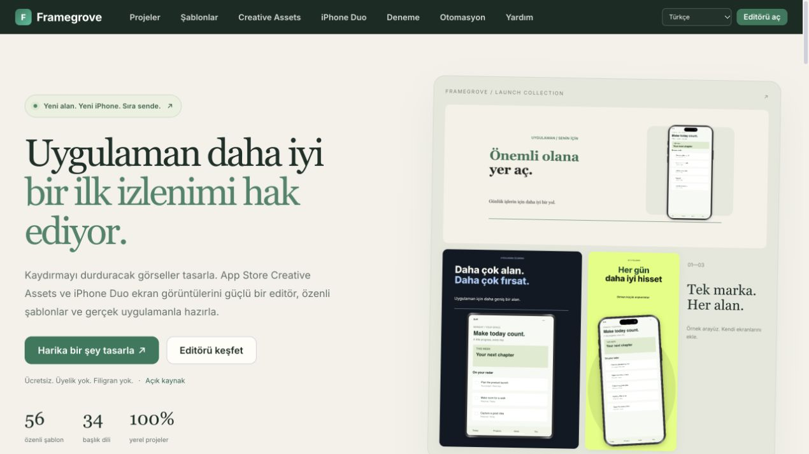

# Framegrove

A free, local-first App Store Creative Assets and screenshot editor.

Live: https://framegrove.bamstudio.dev



- 56 curated templates and 172 editable compositions.
- App Store Header, Search and Universal Creative Assets.
- Dedicated iPhone Duo inner, outer and inner-landscape series.
- Eight website languages, 34 caption languages, exact-size exports.
- Local projects, standalone MCP/CLI and a reusable agent skill.
- Resize & adapt: save the original and create a separate editable variation for any preset or custom canvas.
- Free, MIT licensed, no signup or watermark.

[Creative Assets guide](https://framegrove.bamstudio.dev/creative-assets/) · [Duo guide](https://framegrove.bamstudio.dev/iphone-duo/) · [Automation](https://framegrove.bamstudio.dev/mcp/)

## Web editor

From a source checkout: `python3 scripts/build.py` then `python3 -m http.server 8766 --directory public`.

Choose an output from the editor menu or use **Resize & adapt**. Preview either a fitted original composition or recomposed text and devices, then save the original and create a variation. Captions, layers and screenshot slots are preserved. Square, story, landscape, presentation and web hero presets are included; custom canvases support 64–16,384 pixels per side, up to 64 megapixels. Review the resulting composition before export.

## MCP and CLI

Requires Node.js 20+. From `mcp/`, run `npm ci` and `npm run fonts`.

```sh
claude mcp add framegrove -- node "$PWD/server.mjs"
node cli.mjs templates
node cli.mjs render --template creative-paper-header --shots ./screenshots --out ./output
```

Installable download: https://framegrove.bamstudio.dev/downloads/framegrove-mcp.zip

Projects and screenshots are stored locally. Optional AI calls use your own provider key. Back up projects with Export Project before clearing browser storage.

Creative Assets must be previewed in App Store Connect for device-specific cropping. Header and Universal PNG exports have no alpha channel.

## Support

https://buymeacoffee.com/bamstudio

## Deployment

```sh
python3 scripts/build.py
npx wrangler deploy
```

The Worker serves `framegrove.bamstudio.dev`. The legacy product route redirects to the new site; the old editor remains available on its original origin so its local IndexedDB projects can still be exported. To move an old project, export it from the old editor and import it into Framegrove.

## Launch validation

56 curated templates: 16 phone series, 24 Apple Creative Assets compositions, 12 iPhone Duo series and 4 tablet series. 568 EN/TR render checks passed. Header, Search, Universal and Duo PNGs were checked for exact dimensions and an RGB colour type without alpha. The standalone MCP download was installed in a clean directory and used to render a Header asset. The live browser Header download was also checked at 3840 × 1646.

## Languages and agent skill

The landing page supports English, Turkish, German, French, Spanish, Italian, Portuguese and Japanese. Turkish browsers start in Turkish; other browsers start in English. Advanced editor help can fall back to English. Captions support 34 languages.

The reusable agent skill is in `skills/framegrove/`. Download it at https://framegrove.bamstudio.dev/downloads/framegrove-skill.zip. MCP provides template discovery, output constraints, rendering, editable projects and exported image inspection.

Duo inner and outer screenshot slots are separate. Apple says Duo uploads will be available later in 2026; check availability before submitting.

Machine-readable product documentation: https://framegrove.bamstudio.dev/llms.txt
